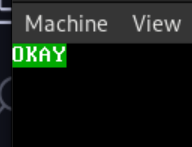

# GDT

## Czym jest GDT

GDT - Global Descriptor Table

GDT przechowuje informacje o konkretnych segmentach pamięci. Informacje te muszą być dostępne w każdym momencie dla procesora, ponieważ może on ich potrzebować przy np. wychodzeniu z rutyny przerwania. Grub ustawił już za nas gotowe GDT 32 bitowe, którego moglibyśmy używać jeśli chcielibyśmy pozostać w trym trybie, ale żeby przejść do trybu 64 bitowego musimy zdefiniować 64 bitowe GDT.

## Struktura GDT
GDT składa się z wielu wpisów, maksymalny rozmiar GDT to 65535 bajtów czyli 8192 wpisy (nikt w praktyce tylu nigdy nie używa), minimalna ilość to 2 wpisy: `NULL SEGMENT`, `CODE SEGMENT`, każdy wpis zajmuje 8 bajtów. GDT zawsze zaczyna się od `NULL SEGMENT`, jest to puste 8 bajtów, które pozostają do dyspozycji dla procesora.

Nasze GDT będzie miało następującą strukturę (TSS zostanie wytłumaczone później): 

| Offset | Nazwa segmentu |
| ------ | -------------- |
| 0x00   | NULL           |
| 0x08   | Code           |
| 0x10   | Data           |
| 0x18   | TSS            |

## Implementacja GDT

Całość implementacji GDT sprowadza się do stworzenia odpowiedniej struktury w sekcji .rodata

> plik src/boot/gdt.asm
```x86asm
PRESENT       equ 1 << 7
NOT_SYS       equ 1 << 4
EXEC          equ 1 << 3
DC            equ 1 << 2
RW            equ 1 << 1
ACCESSED      equ 1 << 0
GRAN_4K       equ 1 << 7
SZ_32         equ 1 << 6
LONG_MODE     equ 1 << 5

section .rodata
gdt:
    .Null: equ $ - gdt
        dq 0
    .Code: equ $ - gdt
        dd 0xFFFF
        db 0
        db PRESENT | NOT_SYS | EXEC | RW
        db GRAN_4K | LONG_MODE | 0xF
        db 0
    .Data: equ $ - gdt
        dd 0xFFFF
        db 0
        db PRESENT | NOT_SYS | RW
        db GRAN_4K | SZ_32 | 0xF
        db 0
    .TSS: equ $ - gdt
        dd 0x00000068
        dd 0x00CF8900
    .Pointer:
        dw $ - gdt - 1
        dq gdt
```

Pojawia nam tu się seria stałych zdefiniowanych na samej górze pliku. Stałe te to bity dostępu i flagi. Poniższa tabela wyjaśnia do czego służa konkretne flagi. 

| Flaga     | Opis                                                                                                                                                         |
| --------- | ------------------------------------------------------------------------------------------------------------------------------------------------------------ |
| PRESENT   | Bit obecności w pamięci                                                                                                                                      |
| NOT_SYS   | Segment użytkownika, kod w nim znajdujący się nie ma dostępu do obszarów systemowych                                                                         |
| EXEC      | Bit informujący o tym czy w segmencie jest kod (1) czy dane (0)                                                                                              |
| DC        | Bit informujący czy kod znajdujący się w nim może być wykonywany z niższym poziomem uprawnień                                                                |
| RW        | Dla segmentu kodu oznacza czy kod jest tylko odczytywalny czy też wykonywalny, dla segmendu danych oznacza czy dane są tylko do odczytu czy odczytu i zapisu |
| ACCESSED  | Bit ustawiany przez procesor, oznacza  czy dany segment został poprawnie załadowany i czy jest dostepny                                                      |
| GRAN_4K   | Limit segmentu jest mnożony raz 4096 co pozwala na jego większy zakres w pamięci                                                                             |
| SZ_32     | Bit trybu 32 bit, 0 oznacza tryb 16 bit, 1 oznacza tryb 32 bit, pomijane w trybie 64 bit                                                                     |
| LONG_MODE | Ustawienie tego bitu oznacza że korzystamy z trybu 64 bit                                                                                                    |

Teraz z tych flag możemy stworzyć konkretne desktryptory, dla przykładu wyjaśnię tworzenie segmentów na bazie segmentu `Code`. 

Zaczniemy od limitu segmentu który określa maksymalny fizyczny adres pamięci w którym znajdują się dane lub kod opisywane przez dany segment. Limit jest określany przez pierwsze dwa bajty oraz dolny półbajt bajtu siódmego, oznacza to że ma on 20 bitów. Maksymalna wartość jaką możemy zapisać to 0xFFFFF i wraz z ustawieniem bitu `GRAN_4K` w flagach trybu spowoduje że mamy do dyzpozycji 1MB pamięci. 

Kolejną częścią będzie adres bazowy. Jest on podzielony na 3 części, `low` posiadającą 2 bajty oraz `mid` i `high` posiadające po 1 bajt. U nas adres bazowy będzie zawsze wyzerowany, ponieważ chcemy osiągać jak najwieksze rozmiary segmentów.

Dalej są flagi dostepu oraz flagi trybu. Flagi dostępu  określają jaki rodzaj dostępu i możemy osiągnąć na pamięci określonej przez dany segment, w przypadku deskryptora code będzie to `PRESENT` - obecność w pamięci, `NOT_SYS`, ustawiony na 1 określa segment systemowy. Oraz `EXEC` i `RW` określające uprawnienia do wykonania, odczytu i zapisu.

Na tej samej zasadzie tworzymy pozostałe desktryptory.

```x86asm
    .Code: equ $ - gdt
        ; ustawienie 16 dolnych bitów limitu na 0xFFFF 
        ; oraz 16 dolnych bitu adresu bazowego na 0x0000
        dd 0xFFFF                           

        db 0
        db PRESENT | NOT_SYS | EXEC | RW
        db GRAN_4K | LONG_MODE | 0xF
        db 0
```

| Zakres | Pole         | Rozmiar  | Opis                                       |
| ------ | ------------ | -------- | ------------------------------------------ |
| 0-16   | Limit (low)  | 16 bitów | Dolne 16 bitów limitu segmentu.            |
| 16-32  | Base (low)   | 16 bitów | Dolne 16 bitów adresu bazowego segmentu.   |
| 32-40  | Base (mid)   | 8 bitów  | Środkowe 8 bitów adresu bazowego segmentu. |
| 40-48  | Access       | 8 bitów  | Flagi dostępu                              |
| 48-52  | Limit (high) | 4 bity   | Górne 4 bity limitu segmentu.              |
| 52-56  | Flags        | 4 bity   | Flagi trybu                                |
| 56-64  | Base (high)  | 8 bitów  | Górne 8 bitów adresu bazowego segmentu.    |


Teraz przejdziemy to TSS. Jest to struktura która w trybie longmode przechowuje wskaźniki do stosów dla przerwań. Jest ona zdefiniowana w dokładnie ten sam sposób co pozostałe struktury GDT, rozszyfrowanie co oznaczają konkretne wartości pozostawiam to samodzielnego rozwinięcia.

GDT jest zakończone wskaźnikiem, jest to struktura która musi zawierać informację o długości GDT (pierwsze 2 bajty) oraz o wskaźniku do jego początku (8 bajtów).

```x86asm
    .Pointer:
        dw $ - gdt - 1
        dq gdt
```

Linijka `dw $ - gdt - 1` powoduje nam wyliczenie długości GDT na etapie kompilacji. Można ją rozwinąć jako `aktualny adres - adres początku GDT - 1`. Następna linijka definiuje nam 64 bitowy wskaźnik do GDT.

## Ładowanie GDT

> plik src/boot.asm
```x86asm
<załączenie stronicowania>
...


    lgdt [gdt.Pointer]
    jmp gdt.Code:long_mode
    mov dword [0xb8000], 0x2f4b2f4f // tego nie zobaczymy już
    hlt

bits 64

long_mode: // tryb 64 bitowy
    cli
    mov ax, gdt.Data
    mov ds, ax
    mov es, ax
    mov fs, ax
    mov gs, ax
    mov ss, ax
    mov rax, 0x2f592f412f4b2f4f
    mov qword [0xb8000], rax
    hlt

...
```

GDT jest ładowanie za pomocą instrukcji `lgdt`, która przyjmuje wskaźnik. Po tym musi nastąpić skok do trybu 64 bitowego wraz z załadowaniem adresu skoku do segmentu kodu.

```x86asm
    lgdt [gdt.Pointer]
    jmp gdt.Code:long_mode
```

Teraz gdy znajdujemy się w trybie 64 bitowym mamy do zrobienia małe porządki. Na początku musimy wyłączyć przerwania, ponieważ wektor przerwań z trybu 32 bitowego nie jest już właściwym wektorem przerwań, do tego używamy instrukcji `cli`. Po tym musimy ustawić nowy segment danych w rejestrach segmentowych.

```x86asm
long_mode: // tryb 64 bitowy
    cli
    mov ax, gdt.Data
    mov ds, ax
    mov es, ax
    mov fs, ax
    mov gs, ax
    mov ss, ax
```

Po tym etapie możemy przejść do wykonywania naszego własnego kodu - wypiszemy na ekranie `OKAY`

```x86asm
    mov rax, 0x2f592f412f4b2f4f
    mov qword [0xb8000], rax
    hlt
```


