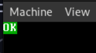

# Testy bootowania

## Test Multiboot

Test ten jest odpowiedzialny za sprawdzenie czy system został odpalony z użyciem multiboot (grub), jest to ważne ponieważ potem można wykorzystywać informację o tym do pozyskania dodatkowych informacji o dostępnym sprzęcie.

Z dokumentacji możemy się dowiedzieć że multiboot na zakończenie swojej pracy ładuje do rejestru `EAX` wartość `0x36d76289`, jeśli jest tam inna wartość to nastąpił jakiegoś rodzaju błąd lub nie kernel nie został uruchomiony z użyciem multiboot

> plik: src/boot/boot_tests.asm
```x86asm
multiboot_check:
    cmp eax, 0x36d76289
    
    ; jeśli EAX nie jest równe powyższej wartości to przechodzimy do obsługi błędu
    jne .multiboot_error
    ret
 
    ; jeśli procedura nie zadziała poprawnie musimy zgłosić błąd
.multiboot_error:
    mov  al, "M"
    call error
```

## Test CPUID

Sprawdzenie obecności CPUID wykonuje się poprzed obrót bitu 21 w rejestrze FLAGS.
Jeżeli uda nam się poprawnie obrócić bit, wpisać wartość do rejestru FLAGS i pobrać ją ponownie i w trakcie tej operacji bit 21 wróci do swojego początkowego stanu to zestaw instrukcji CPUID jest dostępny.

> plik: src/boot/boot_tests.asm
```x86asm
cpuid_check:
    ; skopiowane FLAGS do EAX używając stack-u
    ; pushfd wypycha FLAGS na stack
    pushfd
    pop eax

    ; kopiowanie FLAGS z EAX do ECX
    mov ecx, eax

    ; obrócenie bitu 21
    xor eax, 1 << 21

    ; ustawienie rejestru FLAGS na wartość z EAX z obróconym bitem 21
    push eax
    popfd

    ; ponowne skopiowanie FLAGS do EAX, jeśli bit się obrócił z powrotem to posiadamy CPUID
    pushfd
    pop eax

    ; przywrócenie początkowej wersji rejestru FLAGS
    push ecx
    popfd

    ; jeżeli EAX i ECX są równe to znaczy że bit 21 nie został obrucony co znaczy że nie posiadamy CPUID
    cmp eax, ecx
    je  .cpuid_error
    ret
.cpuid_error:
    mov al, "C"
    jmp error

```

## Test Longmode

Ostatnim krokiem dla nas jest sprawdzenie czy dostępny jest tryb 64 bitowy. Wywołując instrukcję `cpuid` z argumentem `0x80000000` spowoduje sprawdzenie maksymalnej dostępnej wersji CPUID w naszym procesorze, dla naszych potrzeb wystarczy wersja `0x80000001`.

Instrukcja `Cpuid` z argumentem `0x80000001` ładuje do głównych 4 rejestrów dużo informacji na temat procesora, w tym informacje o dostępnych trybach działania oraz posiadanych zestawach instrukcji. Po wywołaniu tej instrukcji w rejestrze `EDX` na bicie 29 znajduje się informacja czy longmode jest dostępny.

> plik: src/boot/boot_tests.asm
```x86asm
long_mode_check:
    ; sprawdzenie czy rozszerzone informacje o procesorze są dostępne
    mov eax, 0x80000000
    cpuid                  
    ; minimalna wersja z longmode to 0x80000001, jeśli jest mniej to wywołujemy błąd
    cmp eax, 0x80000001
    jb  .long_mode_error

    ; sprawdzenie czy longmode jest dostępny
    ; argument dla CPUID do uzyskania rozszerzonych informacji 
    mov eax, 0x80000001
    cpuid

    ; sprawdzenie czy LM-bit jest ustawiony w EDX, jeśli nie to wywołujemy błąd
    test edx, 1 << 29
    jz   .long_mode_error
    ret
.long_mode_error:
    mov al, "L"
    jmp error
```

## Wykorzystanie testów

Testy już są napisane teraz trzeba je wywołać w odpowiedniej kolejności, ponieważ późniejsze testy polegają na poprzednich. Z tego względu kolejność musi być następująca:

1. Multiboot
2. CPUID
3. Longmode

A więc po ich dodaniu metoda `start` będzie wyglądała następująco:

> plik: src/boot.asm
```x86asm
; makro dodające pliki
%include "src/boot/boot_tests.asm"
...
<header multiboot>
...

start:
    mov  esp, stack_top

    ; wywołanie procedury sprawdzenia multiboot
    call multiboot_check
    
    ; wywołanie procedury sprawdzenia CPUID
    call cpuid_check

    ; wywołanie prrocedury sprawdzenia longmode
    call long_mode_check

...
```

## Uruchomienie

Jeżeli wszystko zadziałało poprawnie, po wykonaniu komendy `make run` powinniśmy zobaczyć taki obraz w maszynie:


