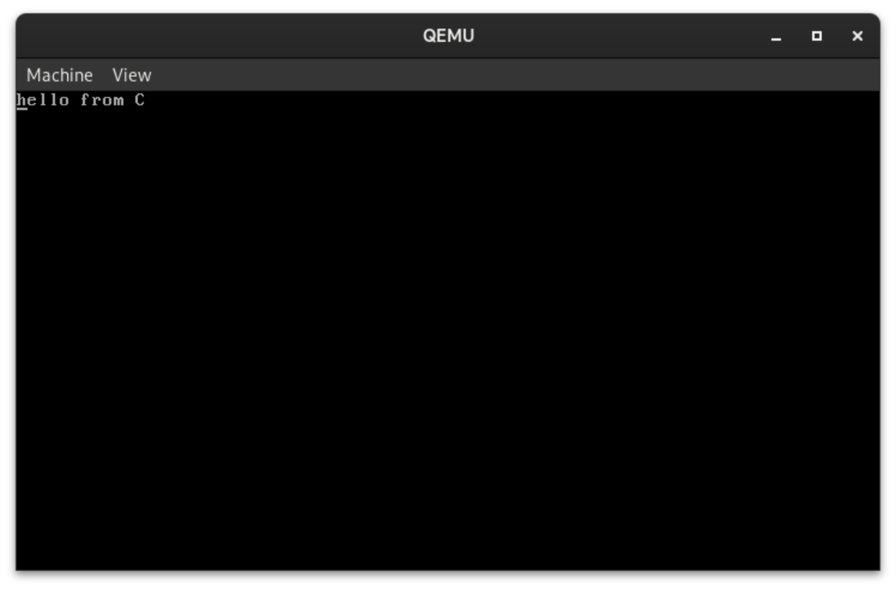

# Pierwsze kroki w C

## Zmiany po stronie assemblera

Niestety ale jeśli chcemy wejść do funkcji w C musimy zrobić jeszcze parę zmian.

Pierwszą z nich będzie skopiowanie wskaźnika do informacji dostarczanych nam przez multiboot2 z rejestru `ebx` do `edi`. Czemu do `edi`? Przez kolejność podawania argumentów. Pierwszy argument przy wywoływaniu funkcji z C w asemblerze jest zawsze w rejestrze `edi`/`rdi`, drugi `esi`/`rsi`, i odpowiednio kolejne są w rejestrach `rdx`,`rcx`, `r8` oraz `r9` (oczywiście tylko dla trybu longmode, w trybie protected wygląda to inaczej)

Modyfikacji dokonujemy jeszcze w trybie 32 bitowym, z rejestru `edi` nigdzie potem nie korzystamy więc możemy to zrobić już teraz, bez przechowywania wskaźnika na stacku lub w sekcji `.bss`

> plik src/boot.asm
```x86asm
...
global start
section .text
bits    32
start:
    mov esp, stack_top
    // nowa linia
    mov edi, ebx

    call multiboot_check
    call cpuid_check
...
```

Ta zmiana pozwoli nam w przyszłości odczytać informacje podane nam przez GRUB2 odnośnie tego ile mamy pamięci oraz jakie sektory zajmują kernel i tabela multiboot

## Funkcja kmain

Naszą funkcją wejściową będzie funkcja `kmain`

> plik src/kmain.c
```c
void kmain(void *multiboot_info) {

}
```

Jak widać powyżej funkcja jest bardzo prosta, przyjmuje jako argument wskaźnik (dla powtórzenia, z rejestru `rdi`) i nie zwraca nic, ponieważ nie będziemy z niej chcieli już wychodzić.

Teraz należy ją wywołać. Ponieważ chcemy pisać 64 bitowy kernel, robimy to z poziomu asemblera z funkcji `long_mode`


> plik src/boot.asm
```x86asm
...
long_mode:
    cli
    mov ax, gdt.Data
    mov ds, ax
    mov es, ax
    mov fs, ax
    mov gs, ax
    mov ss, ax

    // nowe linijki
    extern kmain
    call kmain

    mov rax, 0x2f592f412f4b2f4f
    mov qword [0xb8000], rax
    hlt
...
```

Słowo kluczowe `extern` mówi asemblerowi o tym że taka metoda istnieje ale poza plikami które widzi, metody te mogą pochodzić z bibliotek linkowanych statycznie i dynamicznie.

## Wypisywanie tekstu

Metoda wypisywania tekstu nie różni się od tej której używaliśmy po stronie asemblera. Dane są wpisywane na ten sam adres co wcześniej (`0xb8000`) oraz bajty znaków są przeplatane z bajtem koloru.

> plik src/kmain.c
```c
    // wewnątrz funkcji kmain
    char* to_print = "hello from c";
    char color = 0x0f; // czarne tło biały tekst
    char* addr = (char*)0xb8000; // adres do wypisywania tekstu
    while (*to_print != '\0') // pętla iteruje się do końca napisu
    {
        *addr = *to_print; // wstawiamy aktualny znak
        addr++;
        *addr = color; // wstawiamy kolor
        addr++;

        to_print++;
    }

    while(1){} // nieskończona pętla zapobiegająca wyjściu z funkcji
```

