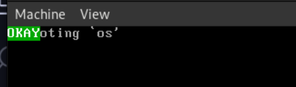
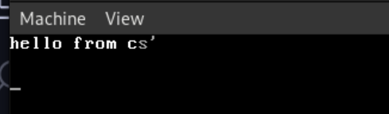

# Part 4 - GDT, tryb 64 bit, C

## Wprowadzenie
W tej cześci wreszcie wejdziemy w długo wyczekiwany tryb 64 bitowy. Wszystko jest już przygotowane oprócz jednej rzeczy... GDT.

## Czym jest GDT
GDT przechowuje informacje o konkretnych segmentach pamięci. Informacje te muszą być dostępne w każdym momencie dla procesor, ponieważ może on ich potrzebować przy np. wychodzeniu z rutyny przerwania. Grub ustawił już za nas gotowe GDT 32 bitowe którego moglibyśmy używać jeśli chcielibyśmy pozostać w trym trybie, ale żeby przejść do trybu 64 bitowego musimy zdefiniować 64 bitowe GDT.

## Wygląd GDT
GDT skłąda się z wielu wpisów, maksymalny rozmiar GDT to 65535 bajtów czyli 8192 wpisy (nitk w praktyce tylu nigdy nie używa), minimalna ilość to 2 wpisy: `NULL SEGMENT`, `CODE SEGMENT`, każdy wpis zajmuje 8 bajtów. GDT zawsze zaczyna się od `NULL SEGMENT`, jest to puste 8 bajtów które pozostają do dyspozycji dla procesora.

| Bity  | Nazwa      | Znaczenie                                                        |
| ----- | ---------- | ---------------------------------------------------------------- |
| 0-41  | -          | ignorowane                                                       |
| 42    | conforming | czy aktualny RING może być wyższy niż wpisany w sekcji privilege |
| 43    | executable | 1 dla segmentu kodu, 0 dla segmentu danych                       |
| 44    | descriptor | 1 dla segmentów kodu i danych, 0 dla innych                      |
| 45-46 | privilege  | 0 dla wpisu kernela, 3 dla wpisu użytkownika                     |
| 47    | present    | flaga obecności (zazwyczaj 1)                                    |
| 48-52 | -          | ignorowane                                                       |
| 53    | 64-bit     | w trybie 64 bit musi być 1                                       |
| 54    | 32-bit     | w trybie 64 bit musi być 0                                       |
| 55-63 | -          | ignorowane                                                       |

## Implementacja GDT
Na początku trzeba zaimplementować `NULL SEGMENT`
> plik: ./src/boot.asm
```x86asm
...
section .rodata
gdt64:
    dq 0 
...
```
Bardzo proste prawda? Jest to po prostu zdefiniowanie zera w odpowiednim miejscu.

No to teraz `CODE SEGMENT`
```x86asm
...
section .rodata
gdt64:
    dq 0 
.code: equ $ - gdt64
    dq (1<<43) | (1<<44) | (1<<47) | (1<<53)
...
```

Tutaj zaczyna się trochę zabawa bo ustawiamy pewne bity które mają bardzo konkretne znaczenie. Rozbijmy to na parę części i odczytajmy co oznaczają konkretne bity z powyższej tabeli:
- `(1<<43)` - executable bit
- `(1<<44)` - descriptor
- `(1<<47)` - present
- `(1<<53)` - 64-bit

Teraz to wygląda prościej no nie? 

Zostaje nam zdefiniowanie pointera do GDT
```x86asm
.pointer:
    dw $ - gdt64 - 1
    dq gdt64
```

Linijka `dw $ - gdt64 - 1` może być ciężka do zrozumienia jeśli nie zobaczymy całości złożonego kodu do GDT
```x86asm
section .rodata
gdt64:
    dq 0
.code: equ $ - gdt64
    dq (1<<43) | (1<<44) | (1<<47) | (1<<53)
.pointer:
    dw $ - gdt64 - 1
    dq gdt64
```

Trochę jaśniej bo wiemy że od symbolu `$` odejmujemy adres `gdt64` i 1, ale co oznacza `$`?

Symbol ten jest aktualnym adresem, czyli to co wyliczamy jest długością naszego `GDT`. następna linijka jest pointerem do `GDT` co tworzy nam tak zwany *fat pointer*, czyli strukturę która oprócz wskaźnika na dane przechowuje również długość wskazywanych danych.

W tym momencie możemy załadować nasze GDT używając instrukcji `lgdt`, czyli dosłownie `Load GDT`.
> plik src/boot.asm
```
...x86asm
bits    32
start:
    ; inicjacja stacku
    mov  esp, stack_top

    ; testy
    call multiboot_check
    call cpuid_check
    call long_mode_check

    call set_up_pageing
    call enable_paging    

    lgdt [gdt64.pointer] 
...
```

> mała wstawka, jeżeli będziemy chcieli zrobić coś więcej z naszym bardzo podstawowym kernelem, aktualne GDT jest nie wystarczające i musi ono być zrobione całkowicie inaczcej.

## Wejście w tryb 64 bit

Można powiedzieć że **wreszcie**, zajęło nam to aż 4 części tego kursu zanim doszliśmy do tego momentu a to już tylko o krok od wejścia do C. Ale i tak dalej zobaczymy jeszcze trochę assemblera.


Mamy już zdefiniowane nasze `GDT` i mamy je wgrane. Teraz możemy zaraz po tym wykonać skok do innego trybu procesora, wykonując sekwencję przejścia.
> plik src/boot.asm
```x86asm
...
    lgdt [gdt64.pointer] 
    ; skok do trybu 64 bitowego
    jmp gdt64.code:long_mode_start
...
```

A więc wykonujemy po prostu długi skok do punktu wejścia trybu 64 bitowego. Ale... jeszcze nie mamy zdefiniowanej funkcji która nam na to pozwoli...

> plik src/long_mode_boot.asm
```x86asm
global long_mode_start

section .text
bits 64
long_mode_start:
    ; przeładowanie rejestrów segmentowych
    mov ax, 0
    mov ss, ax
    mov ds, ax
    mov es, ax
    mov fs, ax
    mov gs, ax

    ; wypisanie OKAY
    mov rax, 0x2f592f412f4b2f4f
    mov qword [0xb8000], rax
    hlt
```

Tutaj można wszystko szybko wytłumaczyć. Rejestry segmentowe określają nam gdzie zapisać dane jeśli wydarzą się zdarzenia (niezależne od nas) które potrzebują zachować jakieś dane w pamięci, takie zdarzenia jak przerwania zewnętrzne, systemowe czy timery.

Normalnie ładuje się tutaj segment danych którego my nie mamy zdefiniowanego więc w naszym przypadku będzie to `null segment`.

A teraz możemy robić już co nam się żywnie podoba w trybie 64 bitowym.

## Uruchomienie w trybie 64 bit


## Przejście do C
**Ważne: zmienia się tutaj makefile, nie będę się o nim rozwodził bo została dodana jedynie kompilacja elementów napisanych w C za pomocą kompilatora gcc. Proszę o samodzielne skompiowane go z repozytorium.**

> plik src/c/kmain.c 
```c
void kmain() {

    asm("hlt");
}
```

Bardzo prosta funkcja `main`, chyba nie trzeba tu nic tłumaczyć osobie która miała już styczność z C oprócz faktu że... ta funkcja nie nazywa się `main`. Niestety nie możemy użyć tutaj tej nazwy ponieważ jest ona zarezerwowana przez kompilator i standard języka i została by ona zamieniona w punkt wejścia `_start` a my tego nie chcemy bo to by nam nadpisało dotychczasowo używany punkt wejścia w ASM. Stąd nazwa kmain. 


Teraz musimy ten nasz punkt wejścia wywołać. Jest to dosyć proste, ponieważ wszystkie funkcje w C możemy wywołać z poziomu ASM jeśli zostaną one odpowiednio linkowane

```x86asm
global long_mode_start

section .text
bits 64
long_mode_start:
    ; przeładowanie rejestrów segmentowych
    mov ax, 0
    mov ss, ax
    mov ds, ax
    mov es, ax
    mov fs, ax
    mov gs, ax

    ; nowe linijki
    extern kmain
    call kmain

    ; wypisanie OKAY
    mov rax, 0x2f592f412f4b2f4f
    mov qword [0xb8000], rax
    hlt
```

I od teraz możemy już pracować tylko w C (prawie tylko, ASM wraca przy paru okazjach). 

## Pierwsze wypisanie tekstu w C

A więc jak już mamy działające C w trybie 64 bitowym to je przetestujmy.

```c

void kmain() {

    // bardzo prymitywne wypisanie danych do terminala, później bedzie obsługiwane przez driver VGA
    char* to_print = "hello from c";
    char color = 0x0f; // czarne tło biały tekst
    char* addr = (char*)0xb8000;
    int i = 0;
    while (to_print[i] != '\0')
    {
        *addr = to_print[i];
        addr++;
        *addr = color;
        addr++;

        i++;
    }

    asm("hlt");
}
```

Ten sposób wypisywania jest dosyć prosty. Mamy tutaj zmienną przechowującą naszego stringa i zmienną przechowującą kolor tekstu i tła. Z pozoru myląca może być zmienna `addr`, jest ona adresem naszego buforu VGA. 

```c
char* addr = (char*)0xb8000;
```

Powyższa linijka może być ciężka do zrozumienia przez osoby które nie miały za dużo doczynienia z niskopoziomowym C. 
Mamy tutaj pointer do tablicy char-ów, ale nigdzie nie przydzielamy mu pamięci. Na poziomie jądra systemu nie mamy żadnego alokatora i dodatkowo adres tu widoczny to nie jest zwykła pamieć. To adres bufora VGA do którego zaraz będziemy wpisywać dane.

```c
while (to_print[i] != '\0')
{
    *addr = to_print[i];
    addr++;
    *addr = color;
    addr++;
    
    i++;
}
```

Tutaj już wypisujemy nasz string. Pętla idzie dopóki nie napotka znaku końca, który jest gwarantowany przez kompilator na końcu każdego string-a który został zdefiniowany na etapie kompilacji. Wypisanie następuje poprzez zamienne wypisywanie znaku oraz jednego bajta określającego jego kolor i kolor jego tła.

Teraz jak już to wszystko wiemy możemy odpalić nasz kernel


## Co dalej

Następnym krokiem będzie wyabstraktowanie wypisywania na ekran oraz zrobienie paru funkcji pomocniczych które normalnie byśmy mieli z biblioteki `stdlib` której niestety tutaj nie mamy dostępnej. 