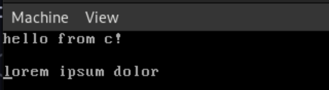
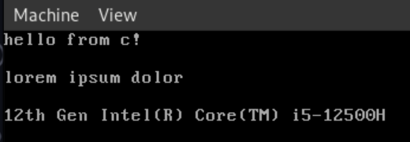

# Part 5 - minimalny driver vga

## Wstęp

VGA text mode, bo tym będziemy się zajmować, jest najbardziej podstawowym trybem wyświetlania jaki znajdziemy w komputerach x86. Mamy w nim mało imponujące 80 kolumn znaków i 25 wierszy.

## Mały stop na definicję int-ów

Osobiście nie lubię tego jak zdefiniowane są typy w C, rozmiary int-ów są trochę nie intuicyjne. Dlatego przygotowałem sobie prosty plik `int.h` który posiada definicje typów całkowitych, które w swojej nazwie posiadają informacje o ich rozmiarze.

> plik src/c/int.h
```c
#pragma once

typedef unsigned char u8;
typedef signed char i8;

typedef unsigned short u16;
typedef signed short i16;

typedef unsigned int u32;
typedef signed int i32;


typedef unsigned long int u64;
typedef signed long int i64;
```
## Zasada działania

VGA text mode posiada adres bazowy (jeden z adresów specjalnych) `0xb8000`, jest on tablicą danych mieszczącą 2000 wpisów każdy po 16 bitów. Pojedyńczy wpis składa się z dwóch bitów, pierwszy określa znak, drugi jego wygląd. 

Struktura wyglądu pojedyńczego znaku

| bity | funkcja     |
| ---- | ----------- |
| 0-3  | kolor znaku |
| 4-6  | kolor tła   |
| 7    | miganie     |

A więc mamy strukturę (w C):
```c
typedef struct VGAChar {
    char ascii_char;
    u8 color;
} VGAChar;
```

Teraz możemy taką strukturę wykorzystać do wpisania danych do naszego buforu:

```c

VGAChar *buffor = (VGAChar*)0xb8000;

VGAChar o = VGAChar {
    .ascii_char = 'o',
    .color = 0x0f,
};


VGAChar k = VGAChar {
    .ascii_char = 'k',
    .color = 0x0f,
};

buffor[0] = o;
buffor[1] = k;
```

W tym momencie możemy w dosyć wygodny sposób wypisywać znaki na ekran. Buffor traktujemy jako tablicę struktur `VGAChar`.

Niestety brakuje nam możliwości przechowania informacji o aktualnym położeniu na ekranie. Dlatego zdefiniujemy strukturę `Writer` w której będziemy przechowywali nasz bufor, razem z pozycjami, oraz domyślnym kolorem.

```c
typedef struct Writer {
    u8 position_width;
    u8 position_height;
    u8 default_color;
    VGAChar *buffer;
} Writer;
```

Pole `position_width` posiada informację o aktualnej kolumnie (jednej z 80), a `position_height` o wierszu (jeden z 25). W tym momencie możemy sobie definiować nasz `Writer` jako globalną zmienną statyczna. To pozwoli nam na napisanie prostego "wrappera" do wypisywania rzeczy na ekranie.

```c
static Writer writer = {
    .position_width = 0,
    .position_height = 0,
    .default_color = (Black << 4) | LightGray,
    .buffer = (VGAChar *)0xb8000,
};
```

Do tego dla uproszczenia stworzymy jeszcze enuma z kolorami. Kolory są 4 bitowe.
```c 
// 4 bitowy kolor
enum Color
{
    Black = 0,
    Blue = 1,
    Green = 2,
    Cyan = 3,
    Red = 4,
    Magenta = 5,
    Brown = 6,
    LightGray = 7,
    DarkGray = 8,
    LightBlue = 9,
    LightGreen = 10,
    LightCyan = 11,
    LightRed = 12,
    Pink = 13,
    Yellow = 14,
    White = 15,
};
```

## Implementacja podstawowych funkcji

A więc teraz jak już mamy globalną "instancję obiektu" która przechowuje informacje o tym co się znajduje na ekranie, możemy wokół niej pisać funkcje.

Będziemy implementować następujące funkcje, oraz zdefiniujemy sobie dwie stałe pomocnicze.
```c

const u8 BUFFER_HEIGHT = 25;
const u8 BUFFER_WIDTH = 80;

void kputnl(); // nowa linia
void kputs(char *); // wypisania string-a
void kputc(char); // wypisanie char-a
void kclear(); // czyszczenie ekranu
void kshift_buffer(); // przesunięcie buforu o wiersz w dół
```

---

Zaczniemy od funkcji czyszczących, ponieważ będą one najprostrza w zrozumieniu.
```c
void kclear() {
    writer.position_width = 0;
    writer.position_height = 0;

    VGAChar empty = {.ascii_char = 0, .color = 0};

    for (u8 width = 0; width < BUFFER_WIDTH; width++)
        for (u8 height = 0; height < BUFFER_HEIGHT; height++)
            writer.buffer[height * BUFFER_WIDTH + width] = empty;
}

void kclear_line() {
    VGAChar empty = {.ascii_char = 0, .color = 0};

    for (u8 width = 0; width < BUFFER_WIDTH; width++) {
        writer.buffer[writer.position_height * BUFFER_WIDTH + width] = empty;
    }
}
```
Zaczniemy od funkcji `kclear`. To co tu robimy to ustawienie aktualnej pozycji kursora na `(0,0)` a następnie zapisanie całego bufora pustymi znakami. Po wywołaniu tej funkcji jedyne co powinno być widać to czarny ekran i nic więcej.

Podobnie działa funkcje `kclear_line` ale na tylko jednej linii (tej w której aktualnie jestesmy); 

---

Możemy już czyścić nasz ekran ale na nic to nam się nie przyda jeżeli nie będziemy mogli po wyczyszczeniu nic na nim wyświetlić. 

```c
void kputc(char ascii) {
    if (ascii == '\n') {
        kputnl();
        return;
    }

    u8 width = writer.position_width;
    u8 height = writer.position_height;

    VGAChar colored_char = {.ascii_char = ascii, .color = writer.default_color};

    writer.buffer[height * BUFFER_WIDTH + width] = colored_char;

    writer.position_width++;

    if (writer.position_width >= BUFFER_WIDTH) kputnl();
}

void kputs(char *ascii) {
    while (*ascii != '\0') {
        kputc(*ascii);
        ascii++;
    }
}
```

Funckjsa `kputc` jest dosyć długa ale działa bardzo prosto. Pierwszą rzeczą którą musimy zrobić to sprawdzić czy nie mamy doczynienia z znakiem nowej linii, `'\n'`, niestety ale sprzęt nie realizuje nowej linii za nas i musimy sami ją zaimplementować co zrobimy później w funkcji `kputnl` która będzie wstawiała nową linię. 

Następnie konstruujemy z podanego znaku strukturę `VGAChar` którą wpisujemy na aktualną pozycję wpisywania.
```c
    VGAChar colored_char = {.ascii_char = ascii, .color = writer.default_color};

    writer.buffer[height * BUFFER_WIDTH + width] = colored_char;
```

Oczywiście musimy przenieść się pozycję dalej, więc musimy zinkrementować indeks kolumny w której się znajdujemy. Ale co nastąpi jak będziemy na kolumnie większej niż maksymalna? Musimy wziąć to pod uwagę, tak samo sytuacja w której będziemy na końcu ostatniego możliwego wiersza (to sprawdzimy w funkcji `kputnl`). Z tego powodu na koniec funkcji, po inkrementacji dodamy sprawdzenie czy przypadkiem nie zaczynamy przepełniać ilości wierszy.

```c
    writer.position_width++;    

    if (writer.position_width >= BUFFER_WIDTH) kputnl();
```

Funkcja kputs, wypisująca string, jest już trochę prostrza. Jest to zwykła pętla idąca po napisie do momentu napotkania znaku terminacji `'\0'` i wypisująca poszczególne znaki.
```c
while (*ascii != '\0') {
    kputc(*ascii);
    ascii++;
}
```

--- 

Teraz zostały nam już dwie funkcje, `kputnl`, do obsługi wstawiania nowej linii, oraz `kshift_buffer` do przesuwania buforu VGA w momencie dojścia do jego końca.

```c
void kputnl() {
    VGAChar empty = {.ascii_char = 0, .color = 0};

    for (u8 width = writer.position_width; width < BUFFER_WIDTH; width++)
        writer.buffer[writer.position_height * BUFFER_WIDTH + width] = empty;

    writer.position_height++;
    writer.position_width = 0;

    if (writer.position_height >= BUFFER_HEIGHT) {
        kshift_buffer();
        writer.position_height--;
        kclear_line();
    }
}

void kshift_buffer() {
    for (u8 height = 0; height < BUFFER_HEIGHT - 1; height++)
        for (u8 width = 0; width < BUFFER_WIDTH; width++)
            writer.buffer[height * BUFFER_WIDTH + width] =
                writer.buffer[(height + 1) * BUFFER_WIDTH + width];
}
```

Funkcja `kputnl` jedyne co robi to zapełnia nam aktualną linię do końca pustymi znakami, a następnie przechodzi na początek nowej linii, natomiast, jeśli nie ma możliwości przejścia do nowej linii (tj. jesteśmy na samym spodzie bufora VGA) musimy wykonać przesunięcie i do tego będzie nam funkcja `kshift_buffer`.

```c
for (u8 height = 0; height < BUFFER_HEIGHT - 1; height++)
    for (u8 width = 0; width < BUFFER_WIDTH; width++)
        writer.buffer[height * BUFFER_WIDTH + width] = writer.buffer[(height + 1) * BUFFER_WIDTH + width];
```
Powyższy kod służy do przeniesienia danych o jeden poziom do góry, możemy to sobie zobrazować dwiema tabelkami (dla uproszczenia przyjąłem 5 wierszy i 3 kolumny).

Przypuśćmy że dane aktualnie wyglądają tak:
| wiersz | dane |
| ------ | ---- |
| 1      | aaa  |
| 2      | bbb  |
| 3      | ccc  |
| 4      | ddd  |
| 5      | eee  |

Po wywołaniu na nich tej funkcji zobaczymy to:

| wiersz | dane |
| ------ | ---- |
| 1      | bbb  |
| 2      | ccc  |
| 3      | ddd  |
| 4      | eee  |
| 5      | eee  |

Niestety jak widać zostaje nam niepotrzebne `eee` na samym dole, ta linijka powinna być wyczyszczona i dlatego w `kputnl` po wywołaniu funkcj `kshift_buffer` musimy wyczyścić linię. Czyli ostatecznie całość będzie wyglądała tak

| wiersz | dane |
| ------ | ---- |
| 1      | bbb  |
| 2      | ccc  |
| 3      | ddd  |
| 4      | eee  |
| 5      |      |
## Użycie

Teraz gdy mamy wszystkie podstawowe funkcje zdefiniowane możemy w namszy pliku main je przetestować.
```c
    kclear();
    kputs("hello from c");
    kputc('!');
    kputnl();
    kputnl();
    kputs("lorem ipsum dolor");
    kputnl();
    kputnl();
```



## Dodatek

Pamiętacie jak w części 2 sprawdzaliśmy obecność CPUID? Teraz możemy to wykorzystać. 

Z CPUID pobierzemy dane na temat modelu procesora i je wyświetlimy.

> plik src/c/cpuid/cpuid.h
```c
#pragma once

#include "../int.h"

static inline u32 cpuid(u32 code, u32 regs[4])
{
    asm volatile("cpuid" : "=a"(*regs), "=b"(*(regs + 1)),
                           "=c"(*(regs + 2)), "=d"(*(regs + 3)) : "a"(code));
    return (int)regs[0];
}

void cpu_name(char buff[48])
{
    u32 regs[12];
    cpuid(0x80000002, regs);
    cpuid(0x80000003, regs + 4);
    cpuid(0x80000004, regs + 8);

    char *str = (char *)regs;
    for (int i = 0; i < 48; i++)
        buff[i] = str[i];
}
```

Jest tutaj niestety linijka z `inline assembly` która może wydawać się ciężka ale nie jest, struktura makra asm jest mało intuicyjna ale dosyć prosta. Podajemy tutaj komendę, rejestry wyjścia oraz rejestry wyjścia oddzielone `:` 

Struktura makra `asm` jest następująca:
```c
asm volatile("komenda" 
    : "=rejestr"(zmienna wyjściowa), "=rejestr 2"(zmienna wyjściowa 2), ... 
    : "rejestr"(zmienna wejściowa), : "rejestr 2"(zmienna wejściowa 2)
);
```

---

Teraz jak to wiemy wytłumaczę jak działa funkcja CPUID

```c
static inline u32 cpuid(u32 code, u32 regs[4])
{
    asm volatile("cpuid" : "=a"(*regs), "=b"(*(regs + 1)),
                           "=c"(*(regs + 2)), "=d"(*(regs + 3)) : "a"(code));
    return (int)regs[0];
}
```

Funkcja przyjmuje dwa argument `u32 code` oraz `u32 regs[4]`, są to odpowiednio komenda dla CPUID oraz cztery rejestry do których trafią dane. Komenda `cpuid` dostaje od nas `code`, czyli polecenie wejściowe mówiące o tym co chcemy otrzymać w rejestrach wynikowych, oraz rejestry wyjściowe które są w odpowiedniej kolejności (`EAX`, `EBX`, `ECX`, `EDX`), do których trafią dane będące skutkiem wykonania tej komendy z konkretnym kodem. Return jest tutaj kompletnie pomijalny, zwraca nam on wartość wyjściową z rejestru `EAX` który rówwnież jest zwracany przez pointer do tablicy rejestrów. 

Przechodząc do funkcji `cpu_name`.  
```c
void cpu_name(char buff[48])
{
    u32 regs[12];
    cpuid(0x80000002, regs);
    cpuid(0x80000003, regs + 4);
    cpuid(0x80000004, regs + 8);

    char *str = (char *)regs;
    for (int i = 0; i < 48; i++)
        buff[i] = str[i];
}
```
Zwraca nam ona nazwę procesora, z dokumentacji `CPUID` wiemy że ta nazwa ma *ZAWSZE* 48 znaków, nieużywane znaki są zapełniane `'\0'`, więc nie będą problemem przy wyświetlaniu, stąd jej argument `char buff[48]` do którego będzie wpisany wynik funkcji. I tutaj zaczynają się schody... Instrukcja CPUID zapełnia maksymalnie 4 rejestry 32 bitowe, czyli równoważność 16 znaków, z tego powodu musimy wykonać tą funkcję 3 razy.

```c
u32 regs[12];
cpuid(0x80000002, regs);
cpuid(0x80000003, regs + 4);
cpuid(0x80000004, regs + 8);
```

Kod `0x80000002` jest kodem pobrania rozszerzonej informacji o procesorze, konkretniej pierwszych 16 znaków jego nazwy. Środkowe 16 znaków oraz ostatnie 16 znaków są dostępne odpowiednio pod kodami `0x80000003` oraz `0x80000004`. Ale czemu wynik zapisujemy w 12 elementowej tablicy `u32`? Sprawdźcie flagi kompilatora w Makefile 😉! Są one tak skonfigurowane żeby pilnować nas co do typów i ich zmian. Potem najzwyczajniej świecie wykonamy cast-owanie na tablicę charów. Argumenty `regs`, `regs+4` oraz `regs+8`, są pointerami do kolejnych 4 elementów w utworzonej tablicy.

Teraz wystarczy przepisać dane do buforu
```c
char *str = (char *)regs;
for (int i = 0; i < 48; i++)
    buff[i] = str[i];
```
Na początku wykonujemy cast-owanie naszej zmiennej `u32 regs[12]` na tablicę znaków, jest to konieczne z powodu ustawień kompilatora które pilnuja typów. Następnie przepisujemy dane do naszego buforu. Czemu przepisujemy a nie  zrobimy coś w stylu `buff = (char*)regs;`? Ponieważ zmienna `regs` jest zmienną alokowaną na stacku zostanie ona zwolniona na koniec działania funkcji. To znaczy że dane znajdujące się za wskaźnikiem do tej funkcji po prostu przepadną. Dlatego musimy przepisać dane do buforu który znajduje się po stronie funkcji wywołującej tą funkcję.

Teraz możemy użyć naszej funkcji: 
```c
char buff[48] = {0};
cpu_name(buff);
kputs(buff);
```

A tak powinno wyglądać wywołanie z użyciem `make run_kvm` 

(ps. nazwa procesora się oczywiście różni)


