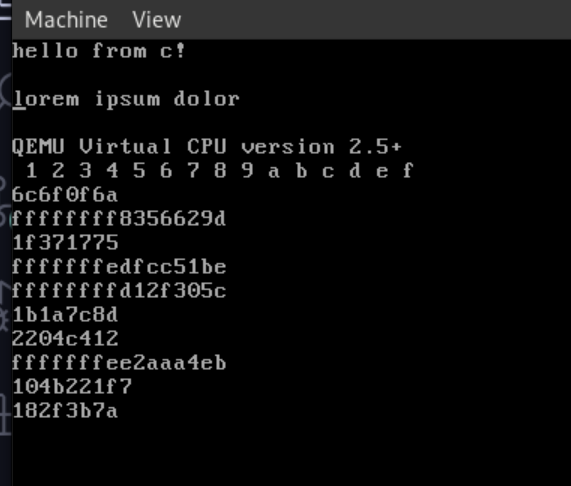

# Part 6 - początek STDLIB i pooling klawiatury PS/2

## Wstęp

`stdlib` będzie nam potrzebny aby w przyszłości ułatwiać niektóre procesy, takie jak konwersja integera na string, lub wyjście i wejście danych do portów. 

Jeśli chodzi o klawiaturę niestety nie będziemy implementować sterowników pod klawiaturę USB. USB jest skomplikowanym protokołem wymagającym szerokeij implementacji aby działało poprawnie. Z tego powodu zostaniemy przy klawiaturze na interfejs PS/2, które jest portem i możę być w łatwy sposób odczytane.

## STDLIB

`stdlib` czyli biblioteka standardowa jest zestawem funkcji i makr które mają ułatwiać nam pisanie sterowników i programów. My zaimplementujemy funkcje takie jak:
- `itoa` (ascii to integer), 
- `swap` (to jest akurat makro)
- `prand` (pseudo random)
- `memcpy` (kopiowanie pamięci)
- `meminit` (inicjacja pamięci)
- `outPort` oraz `inPort` (manipulacja portami)

### itoa i makro swap
Zaczniemy od `itoa` oraz `swap`

```c
#define swap(x, y)        \
    {                     \
        typeof(x) _x = x; \
        typeof(y) _y = y; \
        x = _y;           \
        y = _x;           \
    }

void itoa(i64 ivalue, char *dest, i64 base) {
    u32 idx = 0;

    u8 neg = 0;
    if (base == 10 && ivalue < 0) {
        neg = 1;
        ivalue = -ivalue;
    }
    u64 value = *((u64 *)&ivalue);

    char *chars = "abcdefghijklmnoprstuvwxyz";
    while (value != 0) {
        i64 temp = value % base;

        if (temp < 10) {
            *(dest + idx) = temp + '0';
        } else {
            *(dest + idx) = chars[temp - 10];
        }

        value /= base;
        idx++;
    }

    if (neg) {
        *(dest + idx) = '-';
        idx++;
    }

    for (u32 i = 0; i < idx / 2; i++) swap(dest[i], dest[idx - i - 1]);
}
```

Jak widzicie w tym kawałku kodu, swap nie jest funkcją, jest makrem. Ponieważ C nie ma funkcji generycznych nie możemy zrobić generycznej implementacji funkcji swap, za to możemy zdefiniować generyczne makra. Jeżeli chcieli byśmy rozwinąć to makro dla `int` i `float` to będzie ono odpowiednio wyglądało tak:
```c
    // dla int
    int x = 10;
    int y = 20;
    int _x = x;
    int _y = y;
    x = _y;
    y = _x;


    // dla float
    float x = 10;
    float y = 20;
    float _x = x;
    float _y = y;
    x = _y;
    y = _x;
```

Funkcję `itoa` prawdopodobnie każdy już impelmentował, ale wypadało by wytłumaczyć jak ona tu działa. 

Prześledźmy jej działanie dla liczby `-123` i podstawy 10.
```c
u8 neg = 0;
if (base == 10 && ivalue < 0) {
    neg = 1;
    ivalue = -ivalue;
}
u64 value = *((u64 *)&ivalue);
```

Ten kawałek kodu sprawdza czy liczba jest ujemna, jeśli jest to zapisujemy informację o tym i zmieniamy ją w liczbę dodatnią, to oznacza że aktualna wartość liczby to `123` (obchodzi nas to tylko w przypadku podstawy 10). Następna linijka jest trochę dziwna, jest to transmutacja pamięci. W tym przypadku nie chcemy tracić bitu znaku więc nie możemy wykonać zwykłego `u64 value = (u64)ivalue` dlatego uciekamy się do rozwiązania z transmutacją pamięci.
```c
char *chars = "abcdefghijklmnoprstuvwxyz";
while (value != 0) {
    i64 temp = value % base;

    if (temp < 10) {
        *(dest + idx) = temp + '0';
    } else {
        *(dest + idx) = chars[temp - 10];
    }

    value /= base;
    idx++;
}
```

Ta część kodu chyba nie wymaga większego tłumaczenia. W pętli dzielimy naszą wartość przez bazę dopóki nasza wartość nie jest równa zeru. Z reszty z dzielenia wyliczamy jaki znak musimy wstawić. W przypadku znaków z zakresu 0-9 sytuacja jest prosta bo możemy dodać otrzymaną wratość do znaku `'0'` i otrzymamy porządany znak. Gorzej jest w przypadku pozostałych wartości gdzie musimy konwertować je na litery. W tym momencie w buforze powinniśmy mieć `"321"`.

```c
if (neg) {
    *(dest + idx) = '-';
    idx++;
}
```
Wcześniej zapamiętaliśmy infomrację o tym czy nasza liczba jest ujemna czy dodatnia. W tym momencie możemy znów wykorzystać do dodania znaku `'-'`. Po tej operacji w buforze będziemy mieć wartość `"321-"`. 

```c
for (u32 i = 0; i < idx / 2; i++) swap(dest[i], dest[idx - i - 1]);
```

Pewnie już wszyscy zauważyli że bufor posiada dane w odwrotnej kolejności. Powyższa pętla je nam obróci. Ostatecznie otrzymaliśmy `"-123"`, czyli napis którego oczekiwaliśmy. 

### prand

```c
u64 prand(u64 seed) {
    seed = (seed ^ 61) ^ (seed >> 16);
    seed = seed + (seed << 3);
    seed = seed ^ (seed >> 4);
    seed = seed * 0x27d4eb2d;
    seed = seed ^ (seed >> 15);
    return seed;
}
```

Nasza funkcja prand nie jest skomplikowana. Jest to algorytm mięszania bitów i jest on na tyle prosty że da się blisko zerowym kosztem odzyskać dane które oryginalnie weszły do funkcji, z tego powodu raczej odradzam stosowanie tego algorytmu w wszelkich funkcjach kryptograficznych.

### memcpy oraz meminit

```c
void memcpy(u8 *src, u8 *dest, u32 len) {
    for (u32 i = 0; i < len; i++) dest[i] = src[i];
}

void meminit(u8 byte, u8 *dest, u32 len) {
    for (u32 i = 0; i < len; i++) dest[i] = byte;
}
```

Dwie bardzo proste funkcje. Idą one po tablicach i robią jedną z dwóch rzeczy, jedna kopjuje jedną dablicę do drugiej, druga ustawia na każdzej pozycji pojedyńczy bajt.

### inPort, outPort

```c
void outPort(u16 port, u8 byte) {
    asm volatile("out %1, %0" : : "dN"(port), "a"(byte));
}

char inPort(u16 port) {
    char byte;
    asm volatile("in %1, %0" : "=a"(byte) : "dN"(port));
    return byte;
}
```

Tych funkcji będziemy używać zaraz przy manipulowaniu klawiaturą. Inline assembly wytłumaczyłem już w rozdziale 5 przy okazji przyglądania się `CPUID` więc pozwolę sobie teraz to pominąć. Jak nazwy wskazują, `inPort` pozwala na zapis do portu, `outPort` na wyciągnięcie danych z portu. 

Warto za to wspomnieć o tym że dany port nie jest zawsze tylko jednym portem. W przypadku portów np. od PS/2 będą zapisane inne fizyczne piny przy wykonaniu zapisu za pomocą `outPort` niż by były odczytane za pomocą `inPort`. Zmienna `port` podawana jako argument obu funkcji nie jest w takim razie dosłownym adresem do którego wpisujemy to co się znajdzie na porcie a raczej mówi ona nam o identyfikatorze portu.

### testowanie stdlib

Do pliku `kmain.c` Dodałem następujący kod:
```c

    char num_buff[32] = {0};
    meminit(0, (u8*)num_buff, 32);
    
    for (u8 i = 0; i < 16; i++) {
        meminit(0, (u8*)num_buff, 32);
        itoa(i, num_buff, 16);
        kputs(num_buff);
        kputc(' ');
    }
    kputnl();
    for (u8 i = 0; i < 10; i++) {
        meminit(0, (u8*)num_buff, 32);
        itoa(((i64)prand(i) % 10000000000) - 5000000000, num_buff, 16);
        kputs(num_buff);
        kputnl();
    }

```
Znajdują się tutaj dwie pętle, pierwsza idzie od zera do 16 i wypisuje nam wartości heksadecymalne od `0` do `f`. Druga losuje nam duże liczby i wypisuje je też w zapisie heksadecymalnym. Jeżeli wszystko zadziałało powinniśmy na ekranie widzieć taki, lub podobny widok:



## Klawiatura

Niestety w przypadku klawiatury musimy robić już trochę więcej sami. Tablica kodów skanów nie jest zdefiniowana nigdzie w procesorze, wynika to z tego że na całym świecie używa się różnych klawiatur. W tablicy kodów musimy mieć zdefiniowane 128 klawiszy (jest to maksymalna ilość wspierana przez klawiaturę) oraz musimy zrobić jej kopię na scenariusz w którym jest wciśnięty `shift` lub `caps lock` (jej nie będziemy na ten moment używać). Ponieważ wartości kodów odpowiadają 7 bitowym wartościom ascii będziemy używać wartośc `255` jako oznaczenia dla nierozpoznawalnego kodu. 

> plik ./src/c/keyboard/keyboard.h
```c
const char OTHER = 255;

const char keys[128] = {
    OTHER, OTHER, '1',   '2',   '3',   '4',   '5',   '6',   '7',   '8',   '9',
    '0',   '-',   '=',   '\b',  '\t',  'q',   'w',   'e',   'r',   't',   'y',
    'u',   'i',   'o',   'p',   '[',   ']',   '\n',  OTHER, 'a',   's',   'd',
    'f',   'g',   'h',   'j',   'k',   'l',   ';',   '\'',  '`',   OTHER, '\\',
    'z',   'x',   'c',   'v',   'b',   'n',   'm',   ',',   '.',   '/',   OTHER,
    '*',   OTHER, ' ',   OTHER, OTHER, OTHER, OTHER, OTHER, OTHER, OTHER, OTHER,
    OTHER, OTHER, OTHER, OTHER, OTHER, OTHER, OTHER, OTHER, OTHER, OTHER, OTHER,
    OTHER, OTHER, OTHER, OTHER, OTHER, OTHER, OTHER, OTHER, OTHER, OTHER, OTHER,
    OTHER, OTHER, OTHER, OTHER, OTHER, OTHER, OTHER, OTHER, OTHER, OTHER, OTHER,
    OTHER, OTHER, OTHER, OTHER, OTHER, OTHER, OTHER, OTHER, OTHER, OTHER, OTHER,
    OTHER, OTHER, OTHER, OTHER, OTHER, OTHER, OTHER, OTHER, OTHER, OTHER, OTHER,
    OTHER, OTHER, OTHER, OTHER, OTHER, OTHER, OTHER};

const char upper[128] = {
    OTHER, OTHER, '!',   '@',   '#',   '$',   '%',   '^',   '&',   '*',   '(',
    ')',   '_',   '+',   '\b',  '\t',  'Q',   'W',   'E',   'R',   'T',   'Y',
    'U',   'I',   'O',   'P',   '{',   '}',   '\n',  OTHER, 'A',   'S',   'D',
    'F',   'G',   'H',   'J',   'K',   'L',   ':',   '"',   '~',   OTHER, '|',
    'Z',   'X',   'C',   'V',   'B',   'N',   'M',   '<',   '>',   '?',   OTHER,
    '*',   OTHER, ' ',   OTHER, OTHER, OTHER, OTHER, OTHER, OTHER, OTHER, OTHER,
    OTHER, OTHER, OTHER, OTHER, OTHER, OTHER, OTHER, OTHER, '-',   OTHER, OTHER,
    OTHER, '+',   OTHER, OTHER, OTHER, OTHER, OTHER, OTHER, OTHER, OTHER, OTHER,
    OTHER, OTHER, OTHER, OTHER, OTHER, OTHER, OTHER, OTHER, OTHER, OTHER, OTHER,
    OTHER, OTHER, OTHER, OTHER, OTHER, OTHER, OTHER, OTHER, OTHER, OTHER, OTHER,
    OTHER, OTHER, OTHER, OTHER, OTHER, OTHER, OTHER, OTHER, OTHER, OTHER, OTHER,
    OTHER, OTHER, OTHER, OTHER, OTHER, OTHER, OTHER};
```

Bardziej spostrzegawcze osoby pewnie zauważyły pewną rzecz. Układ znaków w tablicach mniej więcej pokrywa się z fizycznym układem znaków na klawiaturze.

```c
const u8 scan_mask = 0b01111111;
const u16 ps2_io_port = 0x60;
const u16 ps2_control_port = 0x64;

void init_keyboard() { outPort(ps2_control_port, 0xFF); }

char scan_keyboard() {
    u8 status = inPort(ps2_control_port);
    if (status & 1) {
        u8 input = inPort(ps2_io_port);
        u8 scan = input & scan_mask;
        u8 pressed = input & ~scan_mask;
        if (pressed) {
            return keys[scan];
        }
    }

    return OTHER;
}
```

PS/2 (główny port PS/2) używa dwóch portów, port `0x60` jako port danych i port `0x64` jako port kontrolny. Na port kontrolny wysyłamy sygnały sterujące zachowaniem klawiatury, my musimy wywołać tylko jeden, sygnał resetu. Wysyłając wartość `0xff` na port kontrolny wywołujemy reset klawiatury, klawiatura w tym momencie czyści wewnętrzny bufor i wykonuje samodzielną sekwencję startową która przygotuje ją do pracy w jej domyślnym układzie. Ponieważ inicjacja jest po naszej stronie tak krótka, funkcja `init_keyboard` ma dosłownie jedną linijkę.

Trochę bardziej skomplikowana za to jest funkcja `scan_keyboard` która będzie nam służyć do odczytu przycisków z klawiatury. 

```c
char scan_keyboard() {
    u8 status = inPort(ps2_control_port);
    if (status & 1) {
        u8 input = inPort(ps2_io_port);
        u8 scan = input & scan_mask;
        u8 pressed = input & ~scan_mask;
        if (pressed) {
            return keys[scan];
        }
    }

    return OTHER;
}
```

Pierwszym krokiem jest odczytanie portu kontrolnego za pomocą funkcji `inPort`. Na pierwszym bicie odczytanych danych będzie informacja o tym czy został zmieniony stan na dowolnym przycisku na klawiaturze, jeśli tak, to możemy przejść do odczytywania portu danych. Niestety w nim nie jest jeszcze tak prosto.

```c
u8 input = inPort(ps2_io_port);
u8 scan = input & scan_mask;        // 0b yxxx xxxx & 0b 0111 1111 => 0b 0xxx xxxx
u8 pressed = input & ~scan_mask;    // 0b yxxx xxxx & 0b 0111 1111 => 0b y000 0000
```

Bajt odczytany z portu danych musi jeszcze zostać podzielony na częśc kodu oraz informację czy przycisk został wciśnięty czy puszczony. Nas obchodzi tylko fakt naciśnięcia przycisku, jako że tylko na nim będziemy zwracać kod skanu.

```c
if (pressed) {
    return keys[scan];
}
```

Jeżeli został naciśnięty przycisk to zwracamy odpowiedni znak z wcześniej zdefiniowanej tablicy kodów. W każdy innym przypadku na końcu funkcji zwracamy znak `OTHER`

---

Teraz możemy przejść do użycia odczytywania klawiatury w funkcji `kmain`.
```c
void kmain() {
    init_keyboard();

    while (1) {
        char key = scan_keyboard();
        if (key != OTHER) {
            kputc(key);
        }
    }

    asm("hlt");
}
```

To co tutaj robimy to inicjacja klawiatury a następnie w pętli głównej odczytywanie wprowadzonego znaku. Jeżeli jest on inny niż `OTHER` możemy go podać na ekran.

## Co dalej 

Dalsze poczynania kursu jeszcze nie są zdefiniowane. Na ten moment planuję przedstawić działanie przerwać i portu COM, w jakiej kolejności? Jeszcze nie wiem.